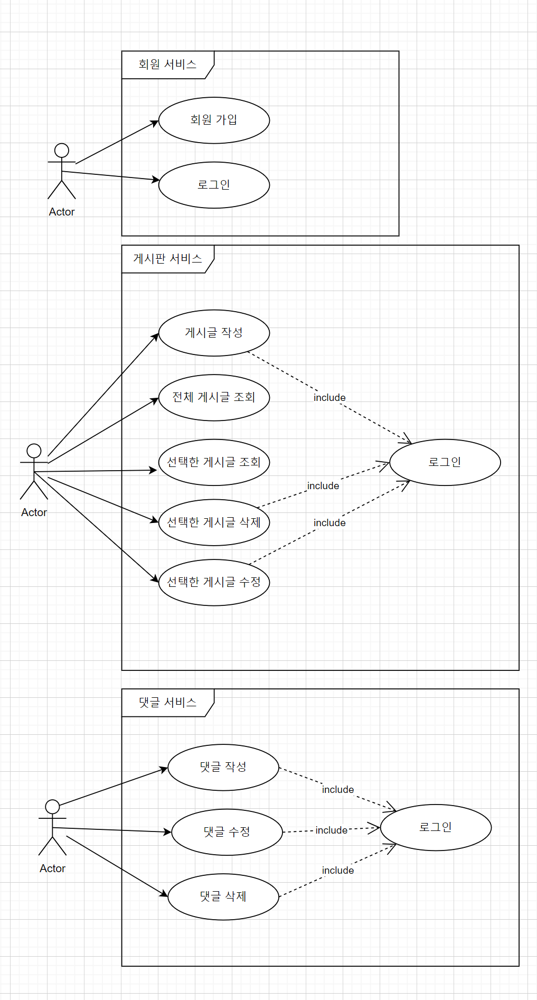
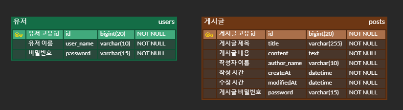

# SWJungleSpringToy
> 카이스트 정글 스프링 토이 프로젝트 ver1.0 
> 
> `ver1.0`: 로그인 기능과 게시글 기능이 분리되어있는 버전
---------------
# 기능
## 인증 기능
### 회원가입
`username` 4자 이상 10자 이하 알파벳 소문자(a ~ z), 숫자(0 ~ 9)
`password` 최소 8자 이상, 15자 이하. 알파벳 대소문자(a ~ z, A ~ Z), 숫자(0 ~ 9)

DB에 중복된 `username` 없다면 회원을 저장하고 client에게 가입에 성공했다는 메시지와 상태코드 전달.
### 로그인
`username`, `password`를 Client에서 전달받기
- DB에서 username을 사용하여 저장된 회원의 유무를 확인하고 있다면 password 비교하기
- 로그인 성공 시, 로그인에 성공한 유저의 정보와 JWT를 활용하여 토큰을 발급하고, 발급한 토큰을 Header에 추가하고 성공했다는 메시지, 상태코드 와 함께 Client에 반환하기

## 게시글 기능
### CRUD
- [x] **전체 게시글 목록 조회 API**
    - 제목, 작성자명, 작성 내용, 작성 날짜를 조회하기
    - 작성 날짜 기준 내림차순으로 정렬하기
- [x] **게시글 작성 API**
    - 제목, 작성자명, 비밀번호, 작성 내용을 저장하고
    - 저장된 게시글을 Client 로 반환하기
- [x] **선택한 게시글 조회 API**
    - 선택한 게시글의 제목, 작성자명, 작성 날짜, 작성 내용을 조회하기 (검색 기능이 아닙니다. 간단한 게시글 조회만 구현해주세요.)
- [x] **선택한 게시글 수정 API**
    - 수정을 요청할 때 수정할 데이터와 비밀번호를 같이 보내서 서버에서 비밀번호 일치 여부를 확인 한 후
    - 제목, 작성자명, 작성 내용을 수정하고 수정된 게시글을 Client 로 반환하기
- [x] **선택한 게시글 삭제 API**
    - 삭제를 요청할 때 비밀번호를 같이 보내서 서버에서 비밀번호 일치 여부를 확인 한 후
    - 선택한 게시글을 삭제하고 Client 로 성공했다는 표시 반환하기

--------------------
# USE CASE DIAGRAM

# ERD

# API 명세서
https://t3rrys-spring-crud-toy-project.gitbook.io/swjunglespringtoy

***
# 수정, 삭제 API의 request를 어떤 방식으로 사용하셨나요? (param, query, body)
   수정 (Update) API:
   Request Body: 수정할 데이터와 비밀번호를 포함하는 DTO를 사용했습니다.
   URL Parameter: 수정할 리소스의 ID를 URL 경로 변수로 사용했습니다.

   삭제 (Delete) API:
   Request Body: 삭제를 요청할 때 비밀번호를 포함하는 DTO를 사용했습니다.
   URL Parameter: 삭제할 리소스의 ID를 URL 경로 변수로 사용했습니다.

# 어떤 상황에 어떤 방식의 request를 써야하나요?
## URL Parameter (Path Variable):
리소스를 식별하기 위한 고유 ID와 같은 경우에 사용합니다.
예: 특정 게시글, 사용자, 상품 등을 조회, 수정, 삭제할 때.

## Query Parameter:
필터링, 정렬, 검색과 같은 부가적인 정보를 전달할 때 사용합니다.
예: 검색 조건, 페이지네이션 정보 등.

## Request Body:
복잡한 데이터를 전달할 때 사용합니다.
예: 생성, 수정 시 필요한 데이터.

## HTTP Headers:
인증 정보나 클라이언트의 상태 정보를 전달할 때 사용합니다.
예: 토큰, 세션 정보 등.

# RESTful한 API를 설계했나요? 어떤 부분이 그런가요? 어떤 부분이 그렇지 않나요?
## RESTful한 부분:
HTTP 메서드를 적절히 사용했습니다. (GET: 조회, POST: 생성, PUT: 수정, DELETE: 삭제)
리소스는 URL을 통해 식별합니다. (예: /posts/{id})
요청 데이터는 적절한 방식으로 전달합니다. (Request Body, URL Parameter)
알맞는 상태코드를 전달하도록 했습니다.

## RESTful하지 않은 부분:
예외처리가 부족하다.
명확하지 않은 HTTP 상태 코드를 전달함.
