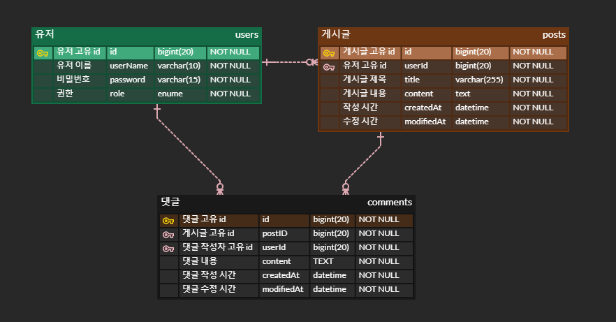

# SWJungleSpringToy
> 카이스트 정글 스프링 토이 프로젝트 ver1.0 
> 
> `ver1.0`: 로그인 기능과 게시글 기능이 분리되어있는 버전
---------------
# 기능
## 인증 기능
### 회원가입
`username` 4자 이상 10자 이하 알파벳 소문자(a ~ z), 숫자(0 ~ 9)
`password` 최소 8자 이상, 15자 이하. 알파벳 대소문자(a ~ z, A ~ Z), 숫자(0 ~ 9)

DB에 중복된 `username` 없다면 회원을 저장하고 client에게 가입에 성공했다는 메시지와 상태코드 전달.
### 로그인
`username`, `password`를 Client에서 전달받기
- DB에서 username을 사용하여 저장된 회원의 유무를 확인하고 있다면 password 비교하기
- 로그인 성공 시, 로그인에 성공한 유저의 정보와 JWT를 활용하여 토큰을 발급하고, 발급한 토큰을 Header에 추가하고 성공했다는 메시지, 상태코드 와 함께 Client에 반환하기

## 게시글 기능
### CRUD
- [x] **전체 게시글 목록 조회 API**
    - 제목, 작성자명, 작성 내용, 작성 날짜를 조회하기
    - 작성 날짜 기준 내림차순으로 정렬하기
- [x] **게시글 작성 API**
    - 제목, 작성자명, 비밀번호, 작성 내용을 저장하고
    - 저장된 게시글을 Client 로 반환하기
- [x] **선택한 게시글 조회 API**
    - 선택한 게시글의 제목, 작성자명, 작성 날짜, 작성 내용을 조회하기 (검색 기능이 아닙니다. 간단한 게시글 조회만 구현해주세요.)
- [x] **선택한 게시글 수정 API**
    - 수정을 요청할 때 수정할 데이터와 비밀번호를 같이 보내서 서버에서 비밀번호 일치 여부를 확인 한 후
    - 제목, 작성자명, 작성 내용을 수정하고 수정된 게시글을 Client 로 반환하기
- [x] **선택한 게시글 삭제 API**
    - 삭제를 요청할 때 비밀번호를 같이 보내서 서버에서 비밀번호 일치 여부를 확인 한 후
    - 선택한 게시글을 삭제하고 Client 로 성공했다는 표시 반환하기

--------------------
# USE CASE DIAGRAM

# ERD

# API 명세서
https://t3rrys-spring-crud-toy-project.gitbook.io/swjunglespringtoy

***
# 왜 DTO, Service 등 여러 레벨에서 유효성 검사를 하나요?

중복된 것 처럼 보이지만, 각 레벨이 고유한 목적을 가지고 있다.
데이터 무결성 보장, 각각의 검사가 담당하는 영역에서 최적의 유효성 검사를 수행.

## DTO 레벨 유효성 검사:

목적: 입력 데이터의 형식과 기본 규칙을 검증하여 클라이언트의 잘못된 요청을 빠르게 필터링합니다.
장점: 코드가 간결해지고, 기본적인 오류를 초기에 감지하여 성능을 최적화할 수 있습니다.

## 서비스 레벨 유효성 검사:

목적: 비즈니스 로직을 반영한 검증을 수행하여, 데이터의 일관성과 비즈니스 규칙을 보장합니다.
장점: 더 복잡한 비즈니스 규칙을 검증할 수 있으며, 데이터베이스와의 상호작용을 포함한 검증을 수행할 수 있습니다.

## 전역 예외 처리기:

목적: 애플리케이션 전반에 걸친 예외를 일관되게 처리하고, 사용자에게 명확한 오류 메시지를 제공합니다.
장점: 예외 처리 로직을 중앙화하여 코드의 가독성과 유지보수성을 높이고, 일관된 오류 응답을 보장합니다.